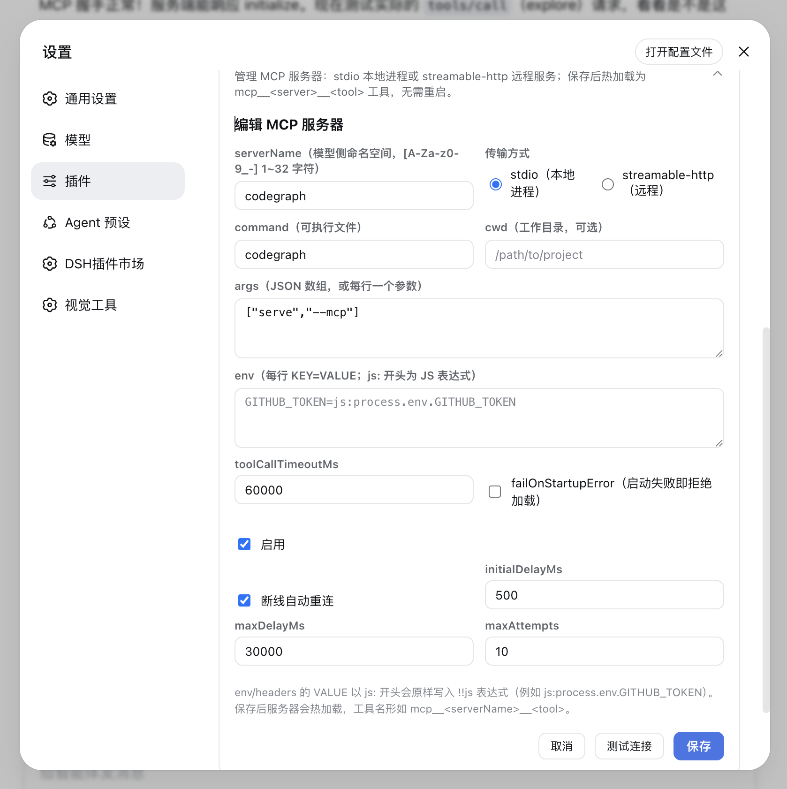
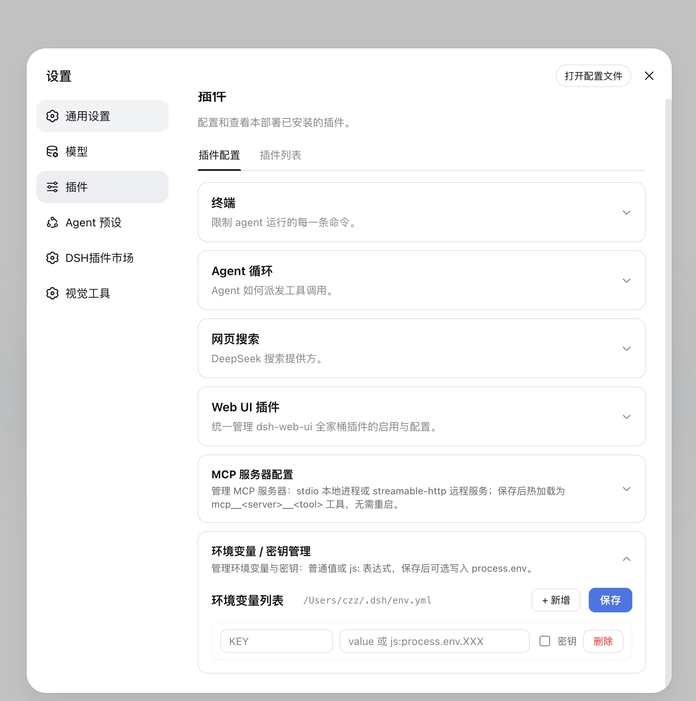
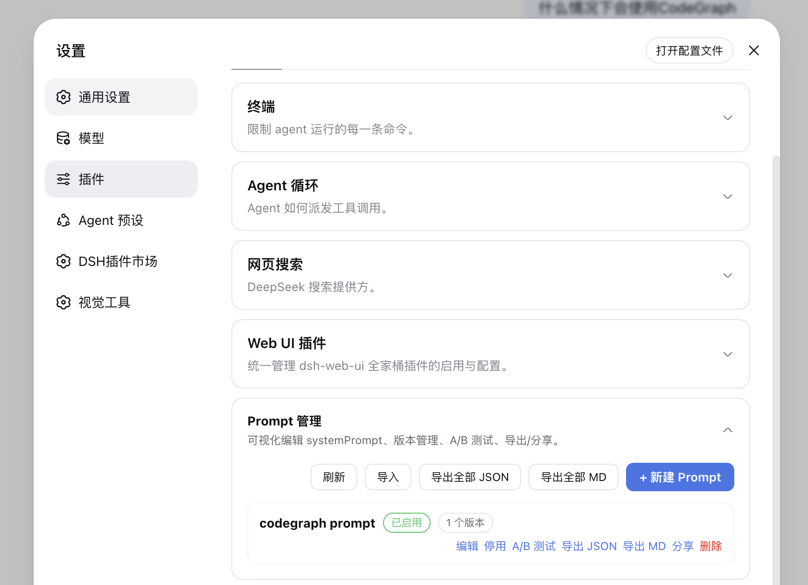
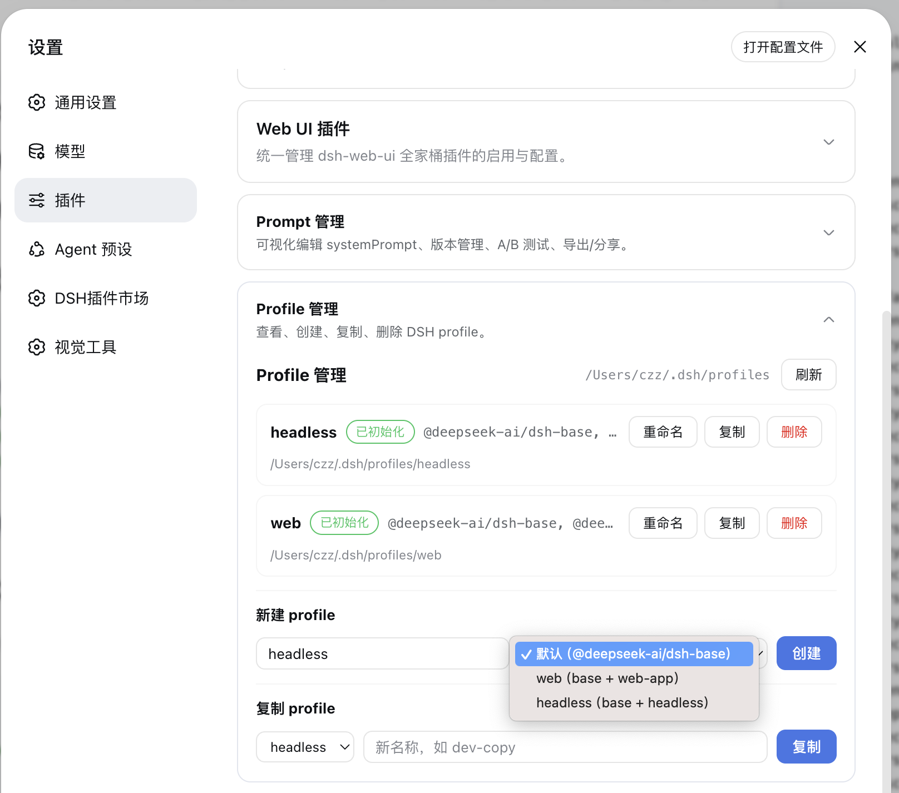
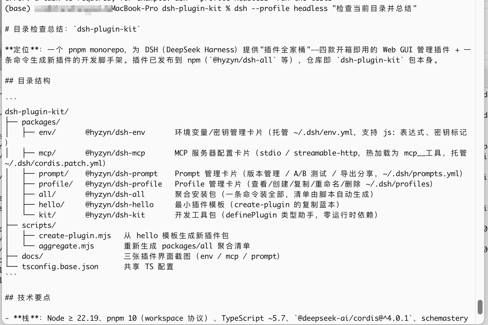
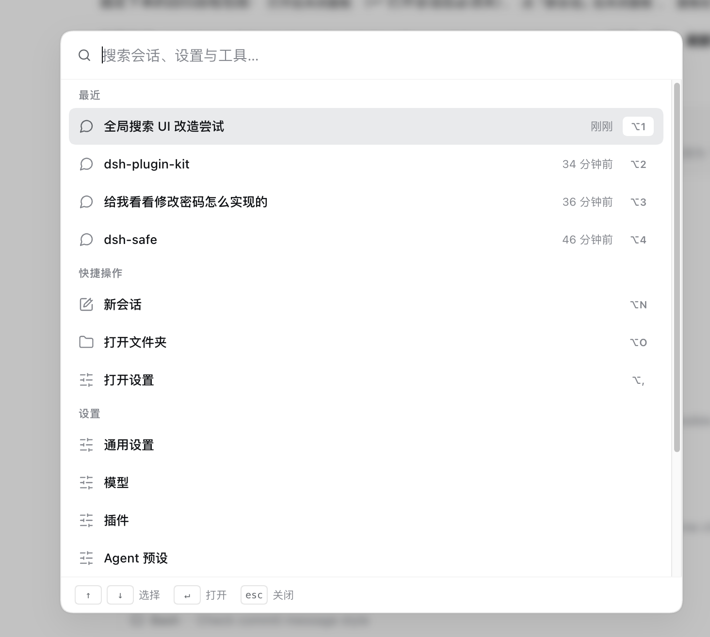
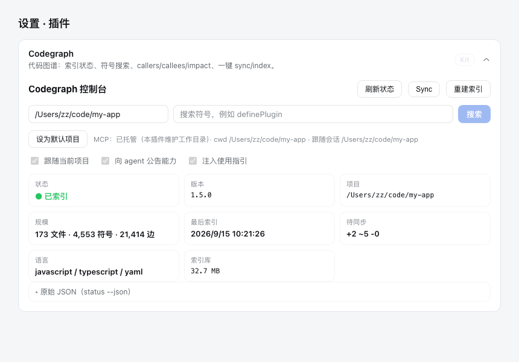
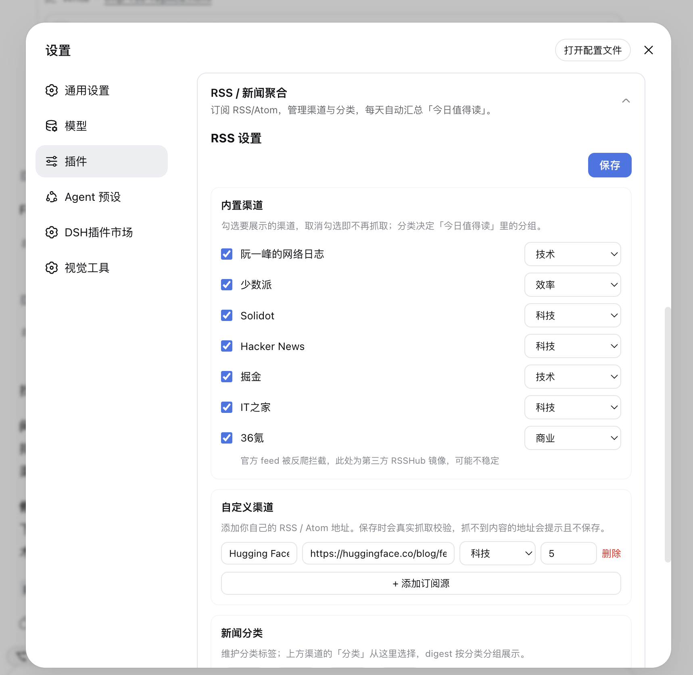
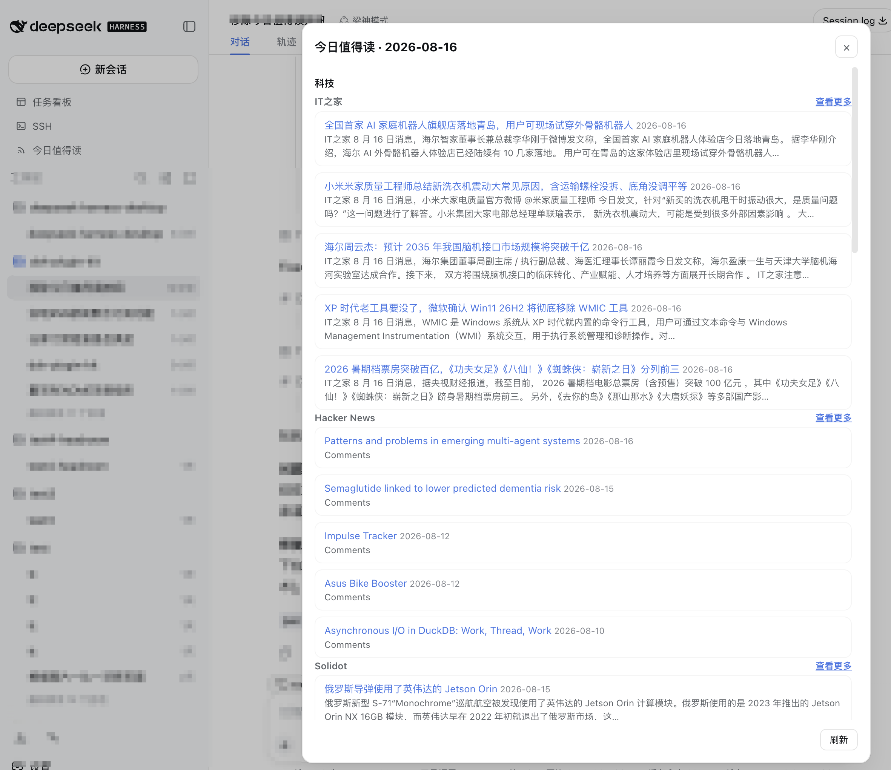
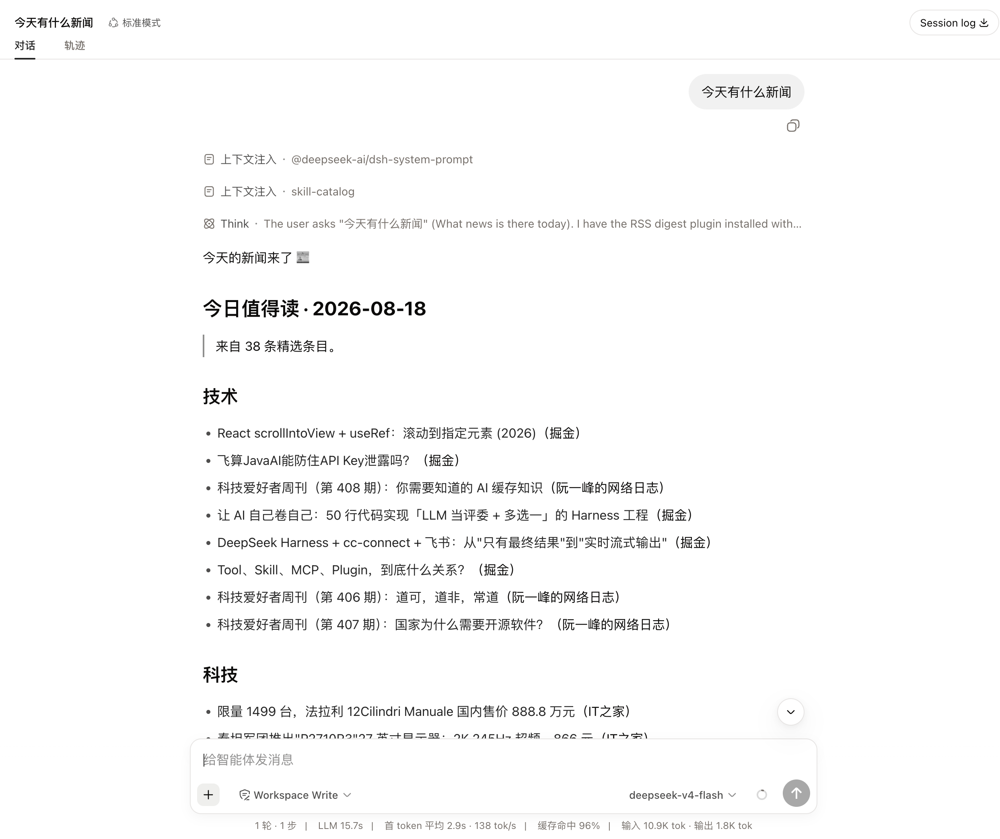

# dsh-plugin-kit · DSH 插件全家桶

中文 | [English](README.en.md)

<p align="center">
  
  &nbsp;
  
  &nbsp;
  
  &nbsp;
  
  &nbsp;
  
</p>

仓库门禁：`pnpm typecheck` / `pnpm build` / `pnpm aggregate`。

<p align="center">
  <strong>DeepSeek Harness（DSH）Web GUI 的插件全家桶</strong><br>
  <em>环境变量 · MCP 服务器 · Prompt · Profile · RSS · 全局搜索 · Codegraph 集成 · 终端面板 · 插件脚手架</em>
</p>

<p align="center">

[是什么](#是什么) · [功能插件](#功能插件) · [快速开始](#快速开始) · [开发新插件](#开发新插件) · [常见问题](#常见问题) · [已知限制](#已知限制) · [参与贡献](#参与贡献)

</p>

## 是什么

dsh-plugin-kit 是给 DeepSeek Harness（DSH）Web GUI 用的通用插件集合：环境变量 / 密钥管理、MCP 服务器配置、Prompt 管理、Profile 管理、RSS / 新闻聚合、全局搜索、Codegraph 集成，外加一条命令生成新插件的开发脚手架。所有插件都走官方 profile 机制挂载到 `dsh web`，不改 DSH 源码；可以逐个安装，也可以用聚合包一次装齐。



| 能力 | 原生 dsh web | dsh-plugin-kit 全家桶 |
| --- | --- | --- |
| 环境变量管理 | 命令行 / 手改配置 | Web GUI 卡片，保存即写入 `process.env` |
| MCP 服务器 | 手改 patch / 命令行 | 可视化卡片 + 连接测试 + 保存后热加载 |
| Prompt 管理 | 手改配置 | 可视化编辑 + 版本管理 / A/B 测试 / 导出分享 |
| Profile 管理 | 命令行 | 可视化创建 / 复制 / 重命名 / 删除 |
| RSS 聚合 | 无 | 多源订阅 + 每日「今日值得读」自动摘要 |
| 全局搜索 | 仅会话标题/内容 | 侧边栏统一全文搜索历史会话、Prompt、MCP 工具与设置面板 |
| Codegraph 集成 | 无 | 代码图谱卡片：索引状态 / 符号搜索 / 调用链 / 影响面 / 一键 sync-index |
| 终端面板 | 无 | 侧边栏「终端」入口 + xterm.js 大弹窗：多标签页真实 PTY 终端（vim/htop/dev server），cwd 跟随会话，配置热生效 |
| 插件开发 | 手写样板 | `pnpm create-plugin` 脚手架 + `@hyzyn/dsh-kit` 类型助手 |

## 功能插件

### 环境变量 / 密钥管理（@hyzyn/dsh-env）

- **做什么**：在 Web GUI 里增删改环境变量和密钥，保存后立即写入当前进程的 `process.env`，宿主和之后启动的子进程都能读到，无需重启。
- **怎么用**：打开 设置 → 插件 →「环境变量 / 密钥管理」→ 添加键值 →（敏感条目勾选「密钥」，以密码框显示）→ 保存。
- **支持**：普通字符串；`js:` 前缀表达式（如 `js:process.env.API_KEY`）；密钥标记。
- **存哪里**：`~/.dsh/env.yml` 的托管区块（自动生成，请勿手改）。
- **注意**：键名只允许字母 / 数字 / 下划线，且不能重复。



### MCP 服务器配置（@hyzyn/dsh-mcp）

- **做什么**：给 DSH 添加 MCP 服务器，保存后 1~2 秒内热加载为 `mcp__<服务器名>__<工具名>` 工具，模型即可直接调用，无需重启。
- **怎么用**：打开 设置 → 插件 →「MCP 服务器配置」→ 添加服务器（选传输方式）→（建议先点「连接测试」）→ 保存。
- **支持**：两种传输——stdio（本地子进程，如 `npx -y @modelcontextprotocol/server-filesystem`）与 streamable-http（远程服务）；`js:` 前缀表达式（如 `js:process.env.GITHUB_TOKEN`）；启用 / 停用、编辑、删除；状态徽章。
- **存哪里**：`~/.dsh/cordis.patch.yml` 的托管区块。
- **注意**：**不要**手工往该文件里追加插件行，否则启动时报 `duplicate loader entry id` 直接退出。


### Prompt 管理（@hyzyn/dsh-prompt）

- **做什么**：可视化编辑 systemPrompt，启用后其内容作为 systemPrompt section 注入，保存即生效。
- **怎么用**：打开 设置 → 插件 →「Prompt 管理」→ 新建 / 编辑 Prompt（可保存多个版本）→ 启用。
- **支持**：版本切换 / 回滚；A/B 测试（为同一 Prompt 选 A/B 两版并按权重随机命中）；导出 JSON / Markdown、一键复制分享、从 JSON 导入。
- **存哪里**：`~/.dsh/prompts.yml` 的托管区块。
- **注意**：每个 Prompt 至少一个版本，单版本内容 ≤ 500KB。



### Profile 管理（@hyzyn/dsh-profile）

- **做什么**：可视化查看 `~/.dsh/profiles` 下的全部 DSH profile，支持创建、复制、重命名、删除，方便维护多套 DSH 环境。
- **怎么用**：打开 设置 → 插件 →「Profile 管理」→ 查看 profile 列表 → 新建 / 复制 / 重命名 / 删除；可为每个 profile 设置端口并复制带 `--port` 的启动命令。
- **支持**：初始化状态、bundle 层与依赖展示；基础模板 / `web` / `headless` 模板新建；复制排除 `node_modules` 与锁文件并自动安装依赖；重命名；端口配置与复制启动命令。
- **存哪里**：直接管理 `~/.dsh/profiles/<name>` 目录。
- **注意**：删除为递归删除，操作前请二次确认；内置的 `web` 默认 profile 不允许删除，`headless` 可以删除；新建后首次使用 `dsh plugin --profile <name> add ...` 时按需安装依赖。





### 全局搜索（@hyzyn/dsh-search）

- **做什么**：在 Web GUI 侧边栏加一个「全局搜索」入口，输入关键词即可全文搜索历史会话与设置面板。
- **怎么用**：安装后在侧边栏「新建会话」下方点击 / 聚焦全局搜索框 → 输入关键词 → 点击会话会打开并尝试定位到匹配文字；点击面板条目会直接跳转到对应设置卡片。
- **支持**：历史会话全文搜索（走 DSH 自带 sessionQuery 索引）；设置面板搜索（官方面板恒可搜，插件面板按已安装动态过滤）；结果数量可配置；结果关键词高亮。
- **存哪里**：无独立配置。
- **注意**：需要宿主已安装 `sessionQuery` 服务；缺失时会话搜索返回空列表。若 `session-query` 全文索引配置为 `openAt: "never"`，历史会话会自动降级为逐会话扫描；会话结果会过滤为当前可跳转的可见会话。



### Codegraph 集成（@hyzyn/dsh-codegraph）

- **做什么**：代码图谱集成——设置 → 插件 里的「Codegraph」卡片提供索引状态、符号搜索、callers / callees / impact 查看和一键 sync / index；安装后自动向 systemPrompt 注入 CodeGraph 使用指引，模型在已索引项目里优先用 `codegraph_explore` / `codegraph explore` 查询代码而不是 grep / read。
- **怎么用**：打开 设置 → 插件 →「Codegraph」→ 查看索引状态、搜索符号、点击结果查看源码与调用链 / 影响面、手动 Sync / 重建索引。
- **支持**：索引状态（版本、文件 / 符号 / 边数量、最后索引时间、待同步变更）；符号搜索与 node / callers / callees / impact 详情；**默认路径跟随当前活动会话的工作目录**（切换项目会话自动切换，手动输入可临时覆盖）；一键增量 sync 与全量重建。
- **存哪里**：索引在项目 `.codegraph/` 目录（由 `codegraph index` 生成）；插件无独立配置文件。
- **注意**：查询目标项目需要先有 Codegraph 索引；未索引项目会返回指引改用常规工具。索引 / 重建为本地 CLI 操作，消耗真实磁盘与 CPU。



### 终端面板（@hyzyn/dsh-tty）

- **做什么**：在 Web GUI 侧边栏加一个「终端」入口，点击打开大弹窗，内嵌 xterm.js 全交互终端（node-pty 真实 PTY），支持多标签页，可运行任意命令与 TUI 程序（vim / htop / dev server 等）。
- **怎么用**：安装后重启 `dsh web`，侧边栏点击「终端」→ 自动创建第一个终端（默认 `$SHELL`）→ 标签栏「+」新建、✕ 关闭；新标签默认在当前 DSH 会话工作目录打开；Ctrl+F 终端内搜索，工具栏清屏/复制/粘贴。
- **最小化到悬浮条**：点弹窗外空白处、按 Esc 或标题栏「—」把面板收进右下角悬浮条，PTY 会话与输出缓冲保持存活；点悬浮条恢复窗口，悬浮条 ✕ 才真正关闭并结束全部会话。
- **支持**：多标签页（单连接多会话，帧协议 v2 带 sid）；cwd 跟随当前会话（sessions 客户端服务）；TERM=xterm-256color 注入（`-c` 包装层，TUI 应用不退化）；resize 透传 node-pty 原生 API；WS 双向帧协议（spawn/input/resize/kill ↔ ready/data/exit/error）；下行背压保护；loopback 信任围栏；并发上限（默认 4）；配置保存即热生效（settings/updated）；agent 工具集（tty_list / tty_capture / tty_send，可查看与交互用户终端里的长驻进程）。
- **存哪里**：无独立配置文件；配置走「设置 → 插件 → 终端面板」卡片。
- **注意**：resize 依赖 DSH 内部 terminal handle 结构（已知限制）；输出为 utf8 文本流，`cat` 二进制文件会有替换字符。详细见 `packages/tty/README.md`。


### RSS / 新闻聚合（@hyzyn/dsh-rss）

- **做什么**：订阅多个 RSS / Atom 源，每天自动汇总成一篇「今日值得读」Markdown，并注入 systemPrompt 供模型直接引用。
- **怎么用**：安装后可在侧边栏「新建会话」下方点击「今日值得读」直接查看新闻；也可打开 设置 → 插件 →「RSS / 新闻聚合」勾选内置渠道、添加自定义渠道（保存时即时校验地址）、从 [awesome-rsshub-routes](https://jackyst0.github.io/awesome-rsshub-routes/) 订阅源目录搜索并一键添加，维护新闻分类与聚合设置，保存后自动刷新。
- **内置渠道**：阮一峰、少数派、Solidot、Hacker News、掘金、IT之家、36氪（36氪官方 feed 被反爬拦截，内置为第三方 RSSHub 镜像），勾选即展示、取消勾选即不抓取。
- **自定义渠道**：填写任意 RSS / Atom 地址，保存时真实抓取校验——官网首页、非 feed、抓不到内容的地址会报错且不保存。
- **订阅源目录**：内置 awesome-rsshub-routes 精选目录（官方 RSS 与 RSSHub 路由，98 条 / 12 分类），可搜索 / 按分类筛选并一键加入自定义渠道；快照随插件内置，运行时每 12 小时从上游 OPML 静默刷新。
- **新闻分类**：渠道的分类从「新闻分类」列表里选择；digest（Markdown、systemPrompt、弹窗）按分类分组展示，保存时自动把使用中的分类合并进列表。
- **支持**：RSS 2.0 / Atom 解析、按来源去重、每源条数限制、每日定时生成、启动补生成、自定义输出目录、内置渠道库。
- **存哪里**：`~/.dsh/rss-digest/YYYY-MM-DD.md`（可用 `DSH_RSS_DIGEST_DIR` 覆盖）。
- **注意**：首次安装启动时会联网抓取一次；某个源不可达时会在 digest 的「抓取失败」里列出，不影响其它源。







## 快速开始

### 系统要求

- 已安装 DeepSeek Harness，`dsh web` 可正常启动。
- npm 安装方式无额外要求；从仓库安装需要 Node.js >= 22.19 与 pnpm 10。

### 三步上手

1. 安装聚合包：`dsh plugin --profile web add @hyzyn/dsh-all`
2. 重启 `dsh web`，设置 → 插件 里出现全部管理卡片
3. 打开「设置 > 插件」按需使用各卡片，保存后即时生效

### 从 npm 安装（推荐）

插件已发布到 npm（`@hyzyn` scope），一条命令装齐——两种等价方式任选：

```sh
dsh plugin --profile web add @hyzyn/dsh-all              # 聚合安装包
dsh plugin --profile web add @hyzyn/dsh-plugin-kit       # 仓库根 bundle（同样挂载全家桶）
```

装完重启 `dsh web`，打开 设置 → 插件 即可看到全部卡片。只想用某一个插件，见下文「单独安装某个插件」。

### 从 GitHub 仓库安装（开发调试）

插件包已在 npm 发布，仓库安装仅供开发调试（需要 Node.js >= 22.19 与 pnpm 10）。
仓库根目录本身也是一个 DSH bundle（`package.json#dsh.bundle.patch`，由 `pnpm aggregate` 生成），
`dsh plugin add link:$(pwd)` 即可把整个全家桶识别并挂载为一个插件：

```sh
# 1. 克隆仓库
git clone https://github.com/hyzyn/dsh-plugin-kit.git
cd dsh-plugin-kit

# 2. 安装依赖并构建
pnpm install
pnpm build

# 3. 把全家桶链接进 web profile（根包即 bundle，等价于安装 @hyzyn/dsh-all）
dsh plugin --profile web add link:$(pwd)

# 4. 重启 dsh web
dsh web
```

> ⚠️ 如果 web profile 里已经装过 `@hyzyn/dsh-all` 或任一 `@hyzyn/dsh-<包名>`，
> 不要再 add 根包（或 `packages/all`），否则插件行重复挂载会在启动时报
> `duplicate loader entry id`。

> 只想用某个子包：第 3 步改为 `dsh plugin --profile web add link:$(pwd)/packages/<name>` 即可，例如 `packages/mcp`。

> 根包声明了 `dsh` 字段后，GitHub 的 DSH 插件市场（如 DSH-Plugins-Marketplace，
> 按 `dsh.bundle` / `@deepseek-ai/*` 依赖识别）会把本仓库识别为 DSH 插件
> （cordis-plugin），不再标记「非 DSH 插件」。

### 单独安装某个插件

不想装全家桶时，可单独安装任意插件（npm 已发布，直接用包名）：

```sh
dsh plugin --profile web add @hyzyn/dsh-env     # 环境变量 / 密钥管理
dsh plugin --profile web add @hyzyn/dsh-mcp     # MCP 服务器配置
dsh plugin --profile web add @hyzyn/dsh-prompt  # Prompt 管理
dsh plugin --profile web add @hyzyn/dsh-profile # Profile 管理
dsh plugin --profile web add @hyzyn/dsh-rss     # RSS / 新闻聚合
dsh plugin --profile web add @hyzyn/dsh-search  # 全局搜索
dsh plugin --profile web add @hyzyn/dsh-codegraph # Codegraph 集成
dsh plugin --profile web add @hyzyn/dsh-tty     # 终端面板
```

### 验证与卸载

装好重启 `dsh web`，打开 设置 → 插件 出现对应卡片就是生效了；也可以用 `dsh --profile web --dump-config` 确认插件配置层已挂载。卡片没出现，多半是装完没重启 `dsh web`。

卸载：`dsh plugin --profile web remove @hyzyn/dsh-all`（或对应的 `@hyzyn/dsh-<包名>`），然后重启 `dsh web`。

### 安装排障

<details>
<summary><strong>展开查看常见安装问题</strong></summary>

<br>

> **卡片没出现？** 重启 `dsh web`；确认用的是官方 `dsh-web-app` 设置面板（浏览器半体依赖核心 slots 服务）。

> **MCP 服务器保存后没有工具？** 等 1~2 秒 HMR；在卡片里看状态徽章与冲突提示；保存前先点「连接测试」。

> **报 `duplicate loader entry id`？** 多半是手工往 `~/.dsh/cordis.patch.yml` 加了插件行。删掉重复行——插件行只由 bundle 补丁挂载，托管区块只放服务器配置。

> **`npm install` / `npm view` 报 EPERM？** 本机 `~/.npm` 缓存存在 root-owned 文件（历史 npm bug），执行 `sudo chown -R $(id -u):$(id -g) ~/.npm` 修复。pnpm 不受影响。

</details>

## 开发新插件

```sh
pnpm create-plugin <name> [id]
# 例：pnpm create-plugin timer          → packages/timer（@hyzyn/dsh-timer，插件 id: timer）
# 例：pnpm create-plugin pet-tracker pt → packages/pet-tracker（插件 id: pt）
```

脚本会复制 `packages/hello` 模板、替换包名与插件 id，并自动更新聚合包。然后：

1. 编辑 `packages/<name>/src/index.ts` 写插件逻辑；
2. 构建并本地安装调试：

```sh
pnpm --filter @hyzyn/dsh-<name> build
dsh plugin --profile web add link:$(pwd)/packages/<name>
```

### 插件包长什么样（以 hello 为例）

| 文件 / 字段 | 作用 |
| --- | --- |
| `package.json#dsh.bundle.patch` | 指向 `cordis.patch.yml`，声明本包是 bundle 补丁层 |
| `cordis.patch.yml` | `insert` 一行，把插件挂进 profile 阵容 |
| `src/index.ts` | 宿主半体：导出 `{ name, inject, apply }` 形状的 Cordis 插件 |
| `package.json#dsh.client` | 可选：声明浏览器半体，Web GUI 以 `/plugins/<id>/client.js` 加载 |

服务注入两种写法：`inject: ['tools', 'webServer']` 后直接 `ctx.tools`；或运行时 `ctx.get('tools')` 判空。配置用 schemastery 导出同名 `Config` schema。

## 常见问题

<details>
<summary><strong>装完重启了，设置 → 插件里还是没有卡片？</strong></summary>

A: 先确认插件装进了 `web` profile（命令里的 `--profile web`），再用 `dsh --profile web --dump-config` 确认插件配置层已挂载；还不行就看上文「安装排障」。注意页面刷新不够，要重启 `dsh web` 进程。

</details>

<details>
<summary><strong>改了插件代码不生效？</strong></summary>

A: 重新 `pnpm build` 后重启 `dsh web`。如果改的是浏览器半体，可能还需要清一下浏览器缓存或硬刷新。

</details>

<details>
<summary><strong>MCP 服务器保存后没有工具？</strong></summary>

A: 等 1~2 秒 HMR；在卡片里看状态徽章与冲突提示；保存前先点「连接测试」。仍不行就检查服务器进程是否真的能启动、地址是否可达。

</details>

<details>
<summary><strong>报 `duplicate loader entry id`？</strong></summary>

A: 多半是手工往 `~/.dsh/cordis.patch.yml` 加了插件行。删掉重复行——插件行只由 bundle 补丁挂载，托管区块只放服务器配置。

</details>

<details>
<summary><strong>`npm install` / `npm view` 报 EPERM？</strong></summary>

A: 本机 `~/.npm` 缓存存在 root-owned 文件（历史 npm bug），执行 `sudo chown -R $(id -u):$(id -g) ~/.npm` 修复。pnpm 不受影响。

</details>

## 已知限制

- MCP 的 `~/.dsh/cordis.patch.yml` 里托管区块只应放服务器配置；手工追加插件行会导致 `duplicate loader entry id` 启动失败。
- Profile 删除为递归删除，面板内会二次确认，但一旦执行不可撤销；内置 `web` profile 受保护，`headless` 可删。
- RSS 首次启动需要联网抓取；某个源不可达不会阻塞其它源，但当天 digest 可能缺少该源内容。
- 浏览器半体依赖官方 `dsh-web-app` 的设置面板 slots 服务，非官方 Web GUI 可能不显示管理卡片。
- 终端面板（dsh-tty）的 resize 透传依赖 DSH 内部 terminal handle 结构，TERM 注入需经 `-c` 包装层（DSH 硬编码 node-pty name:"dumb"）；详见 `packages/tty/README.md`。
- 仓库安装需要 Node.js >= 22.19 与 pnpm 10，仅供开发调试；npm 安装不受影响。

## 参与贡献

- 新插件用脚手架生成：`pnpm create-plugin <name> [id]`，避免手写样板。
- 提交信息遵循 Conventional Commits（如 `fix(mcp): 修复连接测试超时`），用户可见变更请附截图或验证证据。
- 提交前过门禁：`pnpm typecheck && pnpm build && pnpm aggregate`。
- 增删插件后记得跑 `pnpm aggregate` 重新生成 `packages/all` 聚合清单。

## 许可证

本仓库以 [MIT](LICENSE) 授权。

## 贡献者

<div align="center">

**喜欢这个项目？点个 Star。**

[报告 Bug](https://github.com/hyzyn/dsh-plugin-kit/issues) · [请求功能](https://github.com/hyzyn/dsh-plugin-kit/issues) · [查看 Releases](https://github.com/hyzyn/dsh-plugin-kit/releases)

</div>
