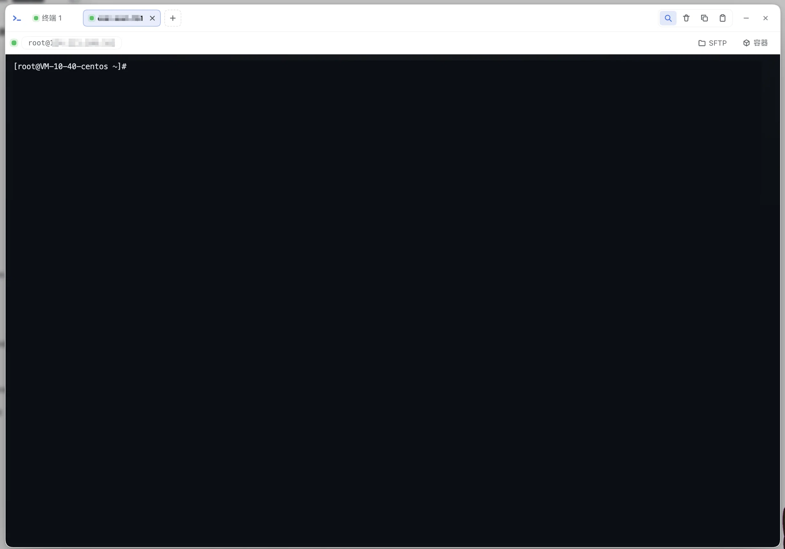
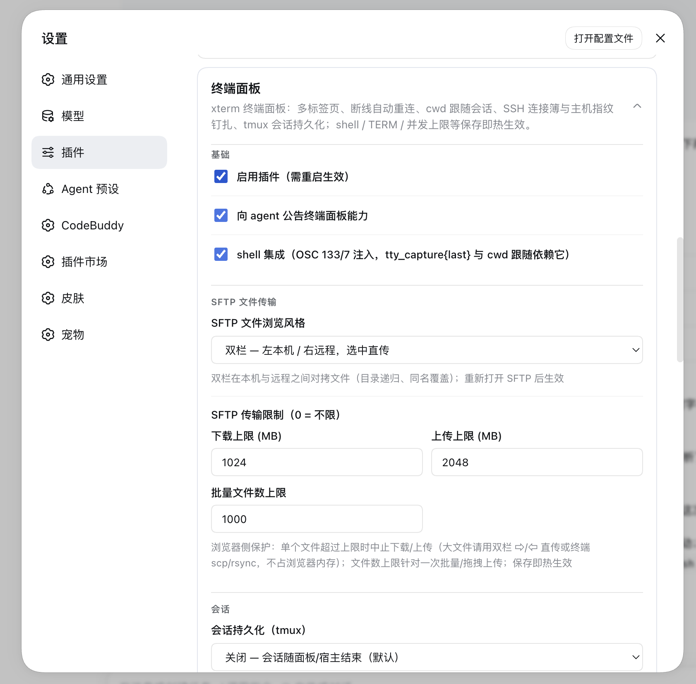
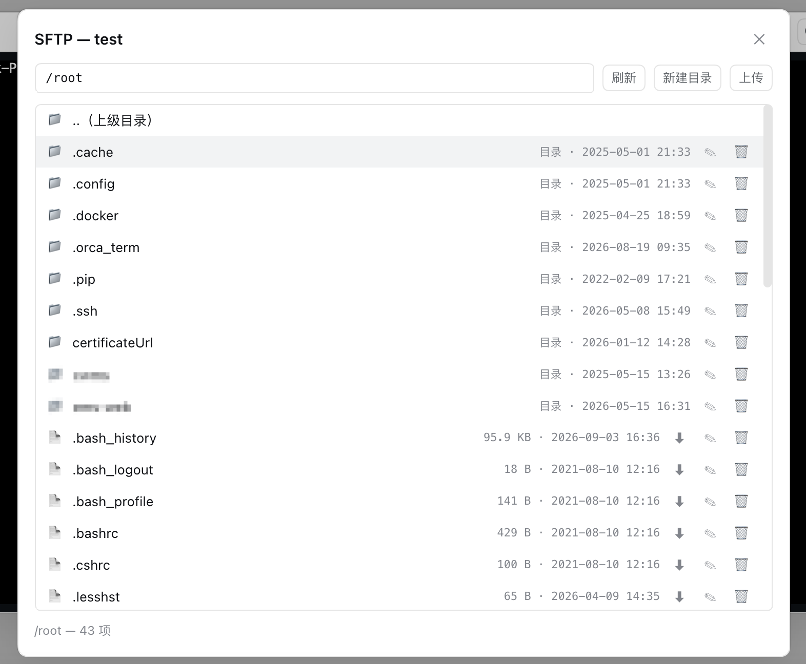
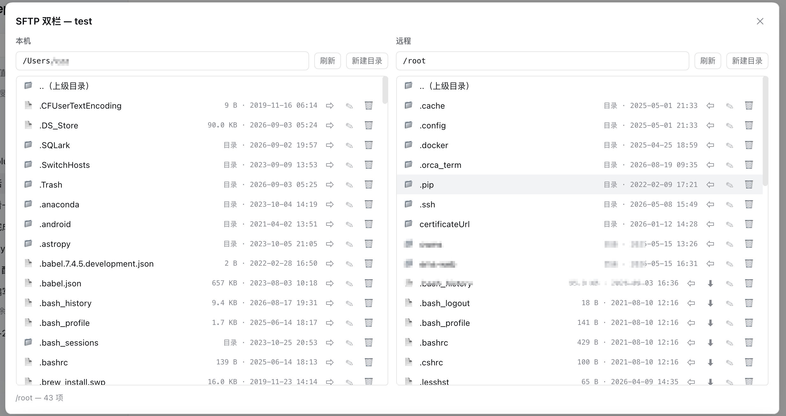

# @hyzyn/dsh-tty

DSH Web GUI 的**终端面板**插件：侧边栏「终端」入口打开一个大弹窗，内嵌
xterm.js 全交互终端（node-pty 真实 PTY，WebGL 渲染器加速），支持**多标签页**，
可运行任意命令与 TUI 程序（vim / htop / dev server 等）。浏览器半体打包了 xterm
内核，宿主半体经 WebSocket 与 PTY 会话双向透传。0.2.0 起支持 **SSH 连接
（方案 C）**：`ssh2` 原生直连远程主机，像本地终端一样交互；0.3.0 起支持
**断线自动重连**与 **SSH 主机指纹 TOFU 钉扎**；0.4.0 起内置 **shell 集成
（OSC 133/7）**——agent 能按「命令」粒度读写终端（`tty_capture{last}` /
`tty_expect`），并支持 **agent forwarding**、**~/.ssh/config 导入** 等深化
能力；0.5.0 起内置**端口转发管理**——连接簿条目配隧道（-L/-R 两向），宿主
自持连接、断线自动重连、状态徽标（见下文）；0.6.0 起 **bash 3.2（macOS
自带）补全命令开始标记**（DEBUG trap 兜底，`tty_capture{last}` /
`tty_expect` 早停恢复可用），设置卡片 **Shell 路径可选可输入**；0.7.0 起内置
**SFTP 文件传输**——SSH 连接的远程目录浏览与上传/下载/新建目录/重命名/删除
（面板「文件浏览」对话框 + agent `sftp_*` 工具，见下文）；0.8.0 起面板支持
**拖拽上传**（文件与文件夹直接拖入，递归展开目录结构逐级上传），agent 侧
补齐**管理闭环**：`sftp_mkdir`（parents 逐级补齐）/ `sftp_rename`（跨目录
移动）/ `sftp_remove`（递归删除）/ `sftp_tree`（限深递归列举）；0.9.0 起
**SFTP 界面可选双栏风格**（左本机 / 右远程、行内直传，宿主服务端对拷），
面板头部压缩为「标签行 + SSH 连接栏」两行。



## 安装

```bash
dsh plugin --profile web add @hyzyn/dsh-tty    # npm 安装（发布后）
dsh plugin --profile web add link:$(pwd)/packages/tty   # 仓库开发调试
```

装完重启 `dsh web`，侧边栏出现「终端」入口，点击打开面板；设置 → 插件 →
「终端面板」卡片可改配置（**保存即热生效**，无需重启）。

## 使用

- 打开面板自动创建第一个终端（默认 `$SHELL`，macOS 上通常是 zsh）；
- **多标签页**：标签栏「+」新建终端（0.2.0 起「+」为菜单：本地终端 /
  SSH 连接簿（条目带 ✎ 编辑）/ SSH 连接…，SSH 见下节）、标签 ✕ 关闭；
  **双击标签可重命名**（重命名随标签持久化，断线恢复后保留）；每个标签
  独立会话（本地 PTY 或 SSH channel）；
- **工作目录跟随当前 DSH 会话**：新标签默认在当前会话工作目录打开
  （宿主配置 `cwd` 作兜底）；
- 支持 vim / htop / less 等 TUI（TERM 已注入为 `xterm-256color`）；
- 面板大小变化自动 resize（xterm fit → PTY 原生 resize）；
- **Ctrl+F 终端内搜索**（Enter 下一个 / Shift+Enter 上一个 / Esc 只关搜索框），
  输出中的链接可点击，工具栏提供 清屏 / 复制选中 / 粘贴；
- **断线自动重连（0.3.0）**：刷新页面、网络抖动等异常断开后，会话在宿主
  保活 `reconnectGraceSec`（默认 120 秒），客户端指数退避自动重连（封顶 5s），
  重连后按 sid **attach 回原会话并回放断线期间的输出缓冲**；页面刷新后从
  sessionStorage 恢复标签列表（宿主侧已结束的会话自动丢弃）；
- **WebGL 渲染器（0.3.0）**：高吞吐输出（build 日志）渲染性能质变；WebGL
  上下文丢失（多标签超出浏览器配额等）时自动回退 DOM 渲染器；
- **最小化（状态并入侧边栏入口）**：点弹窗外空白处、按 Esc 或标题栏「—」
  把面板收起——PTY 会话与输出缓冲保持存活，侧边栏「终端」入口上显示
  「运行中/总数」徽标与状态点（有输出时脉冲提示），点击入口即可恢复；
  悬浮条 ✕ / 标题栏 ✕ 才真正关闭并结束全部会话；
- 标题栏 ✕ 关闭面板并结束全部会话（PTY 树级清理）；会话退出后点终端区域可重开；
- 并发上限默认 4（配置 `maxSessions`，1~16）。



## agent 工具（P1）

插件向 agent 注入十三个工具（与 bash 工具同权，操作实时显示在用户终端里）：

| 工具 | 作用 |
| --- | --- |
| `tty_list` | 列出活跃终端会话（sid / kind（local\|ssh）/ target / pid / **cwd 实时跟随 cd** / 活动时间） |
| `tty_capture` | 读取近期输出（尾部 N 行，默认清洗 ANSI，`raw:true` 取原始流）；**`last:true` 只返回上一条已完成命令的输出 + 退出码**（shell 集成标记，见下节） |
| `tty_screen` | 读取**当前可见屏幕**的渲染结果（xterm-headless 虚拟屏，纯文本）——能真正读懂 vim / htop / 菜单等 TUI 界面 |
| `tty_expect` | 用正则**等待后续输出**中的就绪信号（dev server URL、构建完成等）；超时不抛错（`matched:false` + 尾部输出），命令提前结束也会带退出码早停 |
| `tty_send` | 向指定会话发送按键/文本（如 dev server 的 q 键、菜单选择） |
| `sftp_list` | 列出 SSH 远程目录内容（名称/类型/大小/修改时间，目录在前）；`book` 为连接簿条目名，`path` 缺省为登录 home |
| `sftp_read` | 读取远程**文本**文件（默认 ≤256KB 可调至 1MB，超出截断；含 NUL 字节按二进制拒绝） |
| `sftp_write` | 写远程文本文件（默认覆盖，`append:true` 追加；单次 ≤1MB） |
| `sftp_mkdir` | 创建远程目录；`parents:true` 逐级补齐缺失父目录（等效 `mkdir -p`，自底向上创建，已存在目录幂等跳过） |
| `sftp_rename` | 重命名/移动远程文件或目录（`to` 与 `from` 不同目录即移动；不覆盖已存在的目标） |
| `sftp_remove` | 删除远程文件/目录；目录默认 rmdir（非空明确报错），`recursive:true` 整树删除（不可恢复） |
| `sftp_tree` | 递归列举远程目录结构（深度优先、目录优先；`maxDepth` 1~8 / `maxEntries` 1~2000 限流，超限 `truncated:true`；symlink 不跟随防环） |
| `tunnel_list` | 列出端口转发隧道及其实时状态（活跃/连接中/错误/停止、规则、连接数） |

典型 agent 流程（推荐）：`tty_send` 启动长任务 → `tty_expect` 等就绪标记 →
`tty_capture{last:true}` 拿单条命令结果。此外 `systemPrompt` 里注册了动态
context，每轮对话自动携带活跃终端快照（sid / kind / cwd），无需先调
`tty_list` 也有上下文。

### shell 集成（OSC 133/7，0.4.0）

spawn 时经既有的 `-c` 包装层按 shell 类型注入钩子（对用户透明，不改 rc）：

- **zsh**：`ZDOTDIR` 指向临时桩目录（VS Code 同款方案），桩文件先 source
  用户原 rc 再追加 `precmd`/`preexec` 钩子；
- **bash**：`--rcfile` 桩（先 source `~/.bashrc`）；命令开始标记按版本二选一：
  bash ≥ 4.4 走 `PS0`；bash < 4.4（macOS 自带 3.2）无 PS0，用 **DEBUG trap
  兜底**（handler 按 `$BASH_COMMAND` 过滤掉 PROMPT_COMMAND 机制自身的
  fire，避免幻影标记把用户输出切出捕获区间；bash 3.2 的
  `trap - DEBUG` 在 handler 内卸载不生效，故按「永久武装 + 过滤」设计）。
  副作用：循环体等复合命令的内部命令会多发 B 标记，仅影响
  `tty_capture{last}` 对这类命令的截取起点，D/退出码与 `tty_expect` 不受影响；
  PROMPT_COMMAND 挂钩兼容字符串与数组（bash 5.1+）两种形态；
- 标记语义：`133;A` prompt 开始 / `133;B` 命令开始 / `133;D;<exit>` 命令
  结束带退出码 / `OSC 7 file://…` cwd 上报（`tty_list.cwd` 跟随 `cd`，
  SSH 会话则上报远程路径）；
- 其他 shell 静默关闭；配置 `shellIntegration: false` 可整体关掉（逃生门）。

SSH 会话同表调度：`tty_list` 里 `kind: 'ssh'` 的条目按 `target`
（user@host[:port]）识别，`tty_capture` / `tty_expect` / `tty_send` 用法与
本地会话完全一致——远程机器上的 dev server 日志与按键交互照常可用。

## 端口转发（0.5.0）

设置 → 插件 → 终端面板 卡片的「端口转发」区块维护隧道；每条隧道引用一条
连接簿条目（主机与认证随之），两个方向：

- **本地转发（-L）**：本地 `127.0.0.1:localPort` 监听 → 经 SSH 在服务端侧
  连到 `remoteHost:remotePort`——把远程数据库/内部服务映射到本地（最高频
  用法：`localPort=5432 → db.internal:5432`）；
- **远程转发（-R）**：服务端监听 `remoteHost:remotePort`（缺省
  127.0.0.1）→ 入站连接拨回本地 `localTargetHost:localTargetPort`——把本机
  dev server 暴露给远程/内网；
- **宿主自持生命周期**：隧道与终端标签互相独立（各有各的 SSH 连接），面板
  关了隧道照跑；SSH 断线自动指数退避重连（1s→15s 封顶），remote 方向重连
  后自动重新 forwardIn；连接簿改密码后重连自动用新凭证；
- **状态徽标**：卡片展开期间 2s 轮询实时状态（活跃绿/连接中蓝/错误红/停止
  灰 + 最近错误）；「+」菜单的连接簿条目显示 `⇄N` 隧道徽标；agent 可用
  `tunnel_list` 工具查询状态；
- TOFU 与终端会话共享同一份 hostKeys 钉扎；端口不占用 maxSessions 名额。

## SFTP 文件传输（0.7.0，0.8.0/0.9.0 增强）

不动终端、不占会话名额，直接对 SSH 连接做远程文件操作（`ssh2` 的 sftp
subsystem，宿主半体 `src/sftp.ts`）：





- **入口**：① 标签栏「+」菜单的连接簿条目带 📂（按该条目打开文件浏览）；
  ② SSH 连接对话框填好主机/认证后点「文件浏览」（不落连接簿也能浏览）；
- **操作**：目录浏览（路径框回车跳转、`..（上级目录）`、单击文件即下载）、
  **上传**（多选文件，XHR 流式 + 进度百分比；0.8.0 起支持**拖拽**——文件与
  文件夹直接拖入对话框，文件夹经 `webkitGetAsEntry` 递归展开逐个上传，目录
  用 mkdir parents 逐级补齐）、**下载**（POST → 浏览器 Blob
  → `<a download>`）、**新建目录**、**重命名**（行内编辑器）、**删除**
  （🗑 二次点击确认，目录带 `recursive` 整目录删除）；
- **连接管理**：懒连接池——首次操作才建 SSH 连接，空闲 120 秒自动回收，
  断开后下次操作自动重连；连接簿条目在每次（重）连接时实时解析（改密码
  后自动用新凭证）；TOFU 与终端会话/隧道共用同一份 `hostKeys` 钉扎，指纹
  变同样拒绝；SFTP 不计入 `maxSessions` 名额；
- **传输通道**：`POST /api/dsh-tty/sftp/list|mkdir|rename|remove|download|
  upload`（全部 loopback 围栏）。连接规格经 JSON 体（连接簿名或内联字段，
  与 WS ssh 帧同语义「条目作基底 + 内联逐项覆盖」）或 upload 的
  `x-dsh-sftp-meta` 头（base64url）携带——**凭证不进 URL/查询串**；上传下载
  均为流式 pipe，不整文件进内存；
- **agent 工具**：`sftp_list` / `sftp_read` / `sftp_write` / `sftp_mkdir` /
  `sftp_rename` / `sftp_remove` / `sftp_tree`（见上表）——只收
  `book` 连接簿条目名，**不接受内联凭证**（agent 上下文不进明文密钥）；
- **双栏风格（0.9.0 可选，配置 `sftpStyle`）**：左本机 / 右远程两栏——本机
  侧浏览与文件操作走新增的 `/api/dsh-tty/local-fs` 路由（list/mkdir/rename/
  remove，loopback 围栏）；行内 `⇨ / ⇦` 把条目对拷到对面栏的当前目录
  （`/api/dsh-tty/local-fs/transfer` 由宿主服务端把两个路径流式直传，目录
  递归、同名覆盖，**字节不经过浏览器**）；单窗体风格照旧，设置卡片切换，
  重新打开 SFTP 生效。

## SSH 连接（方案 C）

0.2.0 起标签栏「+」变为一键菜单，除本地终端外还能开 **SSH 标签页**：宿主
半体用 `ssh2` 原生建立连接并打开 shell channel（不经过本地 ssh 进程，也
不占 node-pty），包装成与本地 PTY 完全一致的会话对象——输入、resize、
关闭、输出缓冲、背压与 agent 工具全部复用同一套调度。

- **「+」菜单三个入口**：本地终端 / **SSH 连接簿**（配置里保存过的条目，
  显示 `user@host[:port] · auth`，**条目带 📂 文件浏览与 ✎ 编辑**）/ SSH 连接…
  （表单手填 host / port / username / auth，连接前可勾选保存，对话框底部
  「文件浏览」可跳过终端直接以当前信息打开 SFTP）；
- **连接簿**：SSH 连接对话框勾选「保存到连接簿」即存为条目（同名覆盖，
  名称留空用主机名）；「+」菜单条目的 ✎ 与设置卡片里的 **编辑** 都走同一
  编辑表单（行内改 host/port/username/auth/私钥/密码/agent forwarding，
  支持改名，同名冲突校验，随「保存」写入配置）；
- **认证方式（auth）三选一**：
  - `agent`（默认）——走 ssh-agent（`SSH_AUTH_SOCK`），凭证不落盘，最推荐；
  - `key`——`keyPath` 私钥文件（`~` 开头可省略 home），`passphrase` 可选；
  - `password`——密码认证，同时挂 keyboard-interactive（不少服务端只开这个）；
- **密码 / 口令支持 `env:VAR`**：`password` / `passphrase` 填 `env:MY_SECRET`
  时从宿主进程环境变量取值（配合 dsh-env-manager 插件托管密钥，避免明文
  写进 settings 文件）；
- **端口**：默认 22，非 22 端口在 target 里显示为 `user@host:port`；
- **标签与状态**：SSH 标签标题用连接名或 `user@host`（本地标签是
  「终端 N」）；连接中先回显灰字 `Connecting user@host …`，就绪后状态栏
  显示 `SSH user@host 已连接`；连接失败（连接超时 / 认证被拒 / 主机
  不可达）以 `error` 帧带回原因，标签规格已随标签保存，点终端区域可按
  原规格重开；
- **agent forwarding（0.4.0）**：SSH 对话框勾选「agent forwarding」后远程
  可用本地 ssh-agent 的钥匙（远程 `git clone` 私有仓库等）。任意认证方式下
  都可开（凭证仍不落盘）；本机未运行 ssh-agent 时连接会明确报错而非静默
  失效。连接簿条目随 `agentForward` 保存，列表里显示 `· fwd`；
- **`~/.ssh/config` 导入（0.4.0）**：设置卡片连接簿区「从 ~/.ssh/config
  导入」——解析 `HostName/User/Port/IdentityFile` 生成候选条目（跳过通配符
  块与无 User 条目，`Include` 不展开），同名跳过，随「保存」写入；
- **env:VAR 选择器（0.4.0）**：SSH 对话框的密码/口令字段旁有筛选框 + 限高
  列表，数据源是 **env 插件托管文件里的变量名**（`~/.dsh/env.yml` 托管区块，
  宿主只回名字绝不含值）；点击即填 `env:NAME`。未托管变量时给出提示，仍可
  手输任意 `env:VAR`（连接时校验存在性）；
- **主机指纹 TOFU 钉扎（0.3.0）**：首次连接成功后把该主机（host:port）的
  sha256 指纹记录进 `hostKeys`（随 settings 持久化）；之后每次连接校验，
  指纹一致放行，**指纹变更直接拒绝连接**（防中间人冒充），错误信息带重置
  指引。主机重装/换钥匙后，到 设置 → 插件 → 终端面板 → 「SSH 主机密钥
  记录」删除对应记录再重连即可（记录列表支持删除）。**「从 known_hosts
  导入」（0.4.1）**：一键解析 `~/.ssh/known_hosts` 把已有主机指纹批量
  预填充（连接簿里的主机名还会用于还原 `|1|` hashed 条目，非默认端口按
  `[host]:port` 解析）；
- **计入 `maxSessions` 并发上限**；关断与本地会话一致：标签 ✕ / `kill`
  帧关闭 ssh2 channel，`exit` 帧照常带回退出码 / 信号。

## 配置（设置 → 插件 → 终端面板，保存即热生效）

| 项 | 默认 | 说明 |
| --- | --- | --- |
| `enabled` | true | 关闭整个插件（需重启生效） |
| `announceToAgent` | true | 是否向 agent 公告终端面板能力（systemPrompt 注入） |
| `maxSessions` | 4 | 并发 PTY 会话上限（1~16） |
| `shell` | `$SHELL` | shell 路径；设置卡片可选可输入（下拉候选来自 `/etc/shells` + `$SHELL` + 常见安装路径，仅列存在且可执行者，`$SHELL` 优先），也可手输任意路径 |
| `term` | `xterm-256color` | TERM 值 |
| `colorTerm` | `truecolor` | COLORTERM 值 |
| `cwd` | 宿主启动目录 | 兜底工作目录（客户端当前会话 cwd 优先） |
| `reconnectGraceSec` | 120 | 异常断开后会话保活秒数（0~3600）：刷新页面/网络抖动后会话存活等待重连，超时由回收器结束；`0` = 旧行为，断开立即结束 |
| `sshHosts` | `[]` | SSH 连接簿（面板「+」菜单可选）：条目 `{name, host, port=22, username, auth=agent\|key\|password, keyPath, passphrase, password}`；保存时整体替换、同名覆盖；`password` / `passphrase` 支持 `env:VAR` 引用，避免明文入库 |
| `hostKeys` | `[]` | SSH 主机指纹记录（TOFU，自动维护）：条目 `{host, port, fingerprint}`；按 host:port 唯一，首次连接自动追加，指纹变更拒绝连接；设置卡片可删除重置 |
| `shellIntegration` | true | 注入 OSC 133/7 shell 集成（命令边界标记 + cwd 上报；`tty_capture{last}` 依赖它）；zsh/bash 支持，其他 shell 自动跳过；出兼容问题时可关闭 |
| `tunnels` | `[]` | 端口转发隧道：条目 `{name, bookName, direction=local\|remote, localPort?, remoteHost?, remotePort?, localTargetHost?, localTargetPort?, enabled}`；`bookName` 引用连接簿条目提供主机与认证；卡片「端口转发」区块可视化维护 |
| `sftpStyle` | `dialog` | SFTP 文件浏览界面风格：`dialog` 单窗体（远程目录 + 上传/下载/拖拽）/ `dual` 双栏（左本机 / 右远程，行内 `⇨/⇦` 宿主服务端直传）；重新打开 SFTP 生效 |

## 帧协议（/api/dsh-tty/ws，JSON 文本帧；v3 = 单连接多会话 + 断线重连）

| 方向 | 帧 | 说明 |
| --- | --- | --- |
| C→S | `{t:'spawn', sid?, cols?, rows?, cwd?}` | 创建会话；sid 缺省由宿主生成，cwd 缺省用配置兜底 |
| C→S | `{t:'ssh', sid?, cols?, rows?, name? \| host, username, …}` | 创建 SSH 会话（ssh2 原生）；`name` 引用连接簿条目作基底，内联 `host/port/username/auth/keyPath/passphrase/password/agentForward` 可逐项覆盖 |
| C→S | `{t:'input', sid?, d}` | 按键/粘贴数据 |
| C→S | `{t:'resize', sid?, cols, rows}` | 面板尺寸变化 |
| C→S | `{t:'kill', sid?}` | 关闭会话（孤儿会话也允许跨连接 kill，防泄漏） |
| C→S | `{t:'sessions'}` | 列出全局会话快照（`attachable` 标记可重连者） |
| C→S | `{t:'attach', sid}` | 重连孤儿会话（保活窗口内）：`ready(reattached:true)` 后紧跟一帧 `data` 回放输出缓冲 |
| S→C | `{t:'ready', sid, pid, kind, target?, reattached?}` | 会话就绪；`kind:'local'` 带 pid，`kind:'ssh'` 时 pid=null、target=user@host[:port]；attach 复用此帧并带 `reattached:true` |
| S→C | `{t:'data', sid, d}` | 终端输出（utf8 文本，StringDecoder 兜跨帧多字节序列）；**12ms 窗口/64KB 阈值合并成帧**（0.4.1），exit/kill 前强制冲刷保证帧序 |
| S→C | `{t:'exit', sid, code, signal}` | PTY 退出事实（恰好一次；attach 换连接后仍随当前连接送达） |
| S→C | `{t:'error', sid?, m}` | 错误 |
| S→C | `{t:'sessions', list}` | 会话快照（`{sid, kind, target, pid?, cwd, startedAt, lastOutputAt, attachable}`） |

断线保活语义：客户端正常关面板会先逐个发 `kill` 再断开；因此「WS close
且仍有存活会话」判定为异常断开——会话转入孤儿状态（输出继续积累进环形
缓冲，不向任何连接发送），保活 `reconnectGraceSec` 后由回收器清理；期间
新连接可 `{t:'sessions'}` 查询 + `{t:'attach', sid}` 重连回放。

sid 省略时按「该连接唯一会话」路由；连接上存在 0 或多个会话时省略 sid
会报错。upgrade 路由带 loopback 信任围栏（remoteAddress + Host + Origin
校验），仅本机 Web GUI 可连。

## 开发

```bash
pnpm --filter @hyzyn/dsh-tty build        # tsc 宿主 + esbuild 浏览器半体（client.js）
pnpm --filter @hyzyn/dsh-tty typecheck
pnpm --filter @hyzyn/dsh-tty probe        # M0 探针：PTY 原语验证（需真实 PTY）
pnpm --filter @hyzyn/dsh-tty integration  # 集成测试：真实插件 × 真实 DSH 服务组合
pnpm --filter @hyzyn/dsh-tty live         # 对运行中的 dsh web 做存活冒烟
pnpm --filter @hyzyn/dsh-tty tui          # TUI 冒烟：vim/nano 全屏渲染
pnpm --filter @hyzyn/dsh-tty ssh-smoke    # SSH 冒烟：内存 SSH server（ssh2.Server）× 真实 spawnSsh 端到端（需先 build）
```

浏览器半体源码在 `client-src/index.js`，构建产物 `client.js`（含 xterm 内核）。
改客户端后需重新 `pnpm build` 并刷新页面（可能需硬刷新）。

## 已知限制

- **resize 为内部耦合**：DSH 的 `spawnTerminal` handle 未暴露 resize，
  插件直接透传 `(handle).terminal.resize(cols, rows)`（node-pty 原生 API，
  同进程可达）。DSH 升级若改内部结构，0.3.0 起会警告一次并退化为固定尺寸，
  不再逐帧抛错。
- **TERM 注入用 `-c` 包装层**：DSH 硬编码 node-pty `name:"dumb"`，而
  node-pty 里 name 优先于 env.TERM，因此 shell 以
  `sh -c 'export TERM=...; exec "$shell"'` 方式启动（对用户透明；TERM /
  COLORTERM 值做白名单校验，防止破坏包装层命令）。
- **terminate() 有「幸存者」竞态**：DSH 树级清理偶发报
  `terminal cleanup failed; surviving pids`，插件按 best-effort 处理
  （失败降级对顶层 shell 直接 SIGKILL），退出码/信号可能为 null。
- **输出为 utf8 文本流**：node-pty 数据经 DSH 按 utf8 编码传输，非 UTF-8
  字节会被替换字符吃掉（如 `cat` 二进制文件），属预期行为；跨 chunk 的
  多字节 UTF-8 序列已由 StringDecoder 兜住（0.3.0），中文高速输出不再花。
- 浏览器半体依赖官方 `dsh-web-app` 的侧边栏结构（`[data-pane="sidebar"]`），
  非官方 Web GUI 可能不显示入口。
- **断线保活窗口有限**：异常断开后会话仅在 `reconnectGraceSec`（默认 120s）
  内保活可重连，宿主进程重启则所有会话结束；超期后未重连的会话由回收器
  结束，输出缓冲（尾部 256KB）之外的滚动历史无法恢复。
- **shell 集成仅 zsh / bash**：其他 shell 自动跳过（`tty_capture{last}` 会
  明确报错而非错报）。bash < 4.4 走 DEBUG trap 兜底：循环体等复合命令的
  内部命令会多发 B 标记，`tty_capture{last}` 对这类命令只截取最后一个内部
  命令之后的输出（退出码与 `tty_expect` 不受影响）。用户 rc 若覆盖
  `PROMPT_COMMAND`/钩子数组，集成可能失效——可关闭 `shellIntegration` 或
  反馈补丁兼容。
- **端口转发边界**：本地监听固定 127.0.0.1（不暴露局域网）；remote 方向服务端监听还受服务端 sshd `GatewayPorts` 限制；隧道的 SSH 连接与终端会话独立，均走 TOFU 钉扎与连接簿认证；隧道规格变更（端口/目标/启停）经「保存」热生效，热改连接簿凭证则在下次重连时生效。
- **SFTP 边界**：文件权限 = 对应 SSH 账号的终端权限（无额外沙箱/chroot）；下载经浏览器内存（超大文件建议终端 `scp`/`rsync`）；agent 工具 `sftp_read` ≤1MB 且拒绝二进制、`sftp_write` 单次 ≤1MB（大内容走面板上传或终端）；`sftp_*` 工具只收连接簿条目名，内联凭证仅供面板对话框使用。
- **SSH host key 为 TOFU 钉扎**：首次连接自动记录 sha256 指纹（trust on
  first use），之后指纹一致放行、变更拒绝——不再是无条件放行的
  accept-and-log。注意 TOFU 的固有边界：首次连接若已遭遇 MITM 则记录的
  就是伪指纹；`hostKeys` 随 settings 落盘，指纹变更需人工在设置卡片确认
  并删除记录；`hostKeys` 按 host:port 只存**一条**指纹——同一主机提供多种
  密钥类型（rsa/ed25519/ecdsa）且算法协商变化时可能误报变更，删除记录
  重连即可重新校准；known_hosts 导入同为每主机首条优先。
- **SSH 密码 / 口令建议 `env:VAR` 引用**：连接簿随 settings 文件落盘，
  `password` / `passphrase` 明文入库有泄露面；建议 `env:VAR` +
  dsh-env-manager 托管，或直接用 `agent` 认证（凭证不落盘）。
- **SSH 会话没有本地 pid**：ssh2 shell channel 不是本机进程，`ready.pid`
  为 `null`、`tty_list` 显示 `target` 而非 pid，本机 `ps` / `kill` 对远程
  进程无效——关闭请用标签 ✕ 或 `kill` 帧（关闭的是 ssh2 channel）。

## 工作原理

```
浏览器半体 (client.js, esbuild bundle)
  ├─ 侧边栏「终端」入口 → 大弹窗
  ├─ 标签栏：每标签一个 xterm.js 实例（独立 sid；WebGL 渲染器，丢失回退 DOM）
  ├─ 断线重连：指数退避自动重连 + sessions 查询 + attach 恢复；
  │  标签列表存 sessionStorage（刷新后按 sid 重连保活会话）
  ├─ sessions 客户端服务：新标签带当前会话 cwd
  └─ WebSocket ──→ /api/dsh-tty/ws (webServer.registerUpgrade)
                        │
宿主半体 (src/index.ts)
  ├─ 连接内会话表（sid → 本地 PTY / SSH channel，单连接多会话）
  ├─ SessionManager（maxSessions 上限，热调整；SSH 会话同表调度；
  │  孤儿回收器按 reconnectGraceSec 清理异常断开的会话）
  ├─ 每会话 256KB 环形缓冲（tty_capture / 断线回放）+ xterm-headless
  │  虚拟屏（tty_screen）+ StringDecoder（utf8 分帧兜底）
  ├─ shell 集成（src/shell-integration.ts）：zsh ZDOTDIR / bash --rcfile
  │  桩注入 OSC 133/7 钩子；输出流解析（feedShellIntegration，跨 chunk
  │  残包 carry）→ 命令边界捕获（tty_capture{last} / tty_expect 早停）
  │  与 cwd 跟随（tty_list）
  ├─ 本地路径：ctx.get('subprocess').spawnTerminal({ argv: shell -c 包装层, cwd })
  ├─ 辅助路由：/api/dsh-tty/ssh-config（~/.ssh/config 导入候选）、
  │  /api/dsh-tty/env-vars（env 插件托管变量名）、/api/dsh-tty/known-hosts
  │  （TOFU 指纹预填充，src/known-hosts.ts 解析含 hashed 条目）、
  │  /api/dsh-tty/shells（Shell 路径候选）——均 loopback 围栏
  ├─ SFTP（src/sftp.ts，0.7.0）：懒连接池（空闲 120s 回收、断开按需重连、
  │  TOFU 共用）→ POST /api/dsh-tty/sftp/list|mkdir|rename|remove|download|
  │  upload（spec 走体/头，凭证不进 URL；上传下载流式 pipe）+
  │  sftp_list/read/write/mkdir/rename/remove/tree 工具（只收连接簿名；
  │  mkdir 支持 parents 自底向上逐级补齐，tree 限深限数递归列举）
  ├─ 端口转发（src/tunnels.ts）：宿主自持隧道（-L/-R 双向），断线退避重连、
  │  TOFU 共用、连接计数；GET /api/dsh-tty/tunnels 实时状态 + tunnel_list 工具
  └─ 帧协议：spawn|ssh / input / resize / kill / sessions / attach
     ↔ ready/data/exit/error/sessions + 背压

SSH 路径 (src/ssh.ts，方案 C)
  └─ {t:'ssh'} → spawnSsh：ssh2 Client 原生连接（agent / key / password，
     password·passphrase 支持 env:VAR 取密；host key 经 HostKeyStore
     TOFU 钉扎），开 shell channel 包装成与 PTY 同形状的 TermHandle
     （pid=null，kind='ssh'，target=user@host[:port]），
     背压一并透传到 channel —— 之后与本地 PTY 无差别调度
```

M0 探针、集成测试（B1~B24 共 58 项断言）与真实实例冒烟（live / TUI）在
真实 DSH 服务组合上验证过：TERM 注入、resize 透传、sid 冲突、并发上限、
loopback 围栏、多会话数据隔离、cwd 跟随与校验、配置热生效（settings/updated）、
kill→exit 全链路、断线保活 + sessions/attach 重连回放、tty_screen 虚拟屏、
tty_capture ANSI 清洗、shell 集成（capture{last} + exitCode、OSC 7 cwd
跟随）、tty_expect 匹配与超时、~/.ssh/config 解析器、端口转发（双隧道 active + forwardOut 往返 + reconcile 清理）、
shells 候选路由、bash 3.2 shell 集成（DEBUG trap 兜底：capture{last} +
exitCode、tty_expect 命令结束早停）、SFTP 文件传输（list/mkdir/upload/
download/remove 路由 + sftp_* 工具，test-sshd 内存 sshd 端到端）、SFTP 管理
闭环（agent sftp_mkdir/-rename/-remove/-tree：parents 补齐、tree 限深截断、
跨目录移动、非空删除拒绝与递归删除）。SSH 路径由 `ssh-smoke`
（内存 SSH server × 真实 `spawnSsh`）验证：password 认证建链与 prompt、
命令往返、pty-req 初始尺寸与 resize（window-change）、terminate /
exit-status 全链路，以及 TOFU 指纹记录（S7）与指纹变更拒绝连接（S8）；
SFTP 由 ssh-smoke S9（test-sshd 的 sftp subsystem × 真实 SftpManager）覆盖：
目录列表与 realpath home、上传覆盖+追加、下载（stat size 作 content-length）、
mkdir/rename/非递归删除拒绝/递归删除、TOFU 指纹变更拒绝；S9g 覆盖 mkdir
`parents` 自底向上逐级补齐（幂等）与 `tree` 限深截断/全量。
